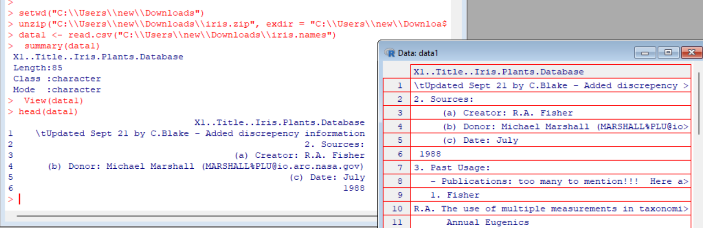
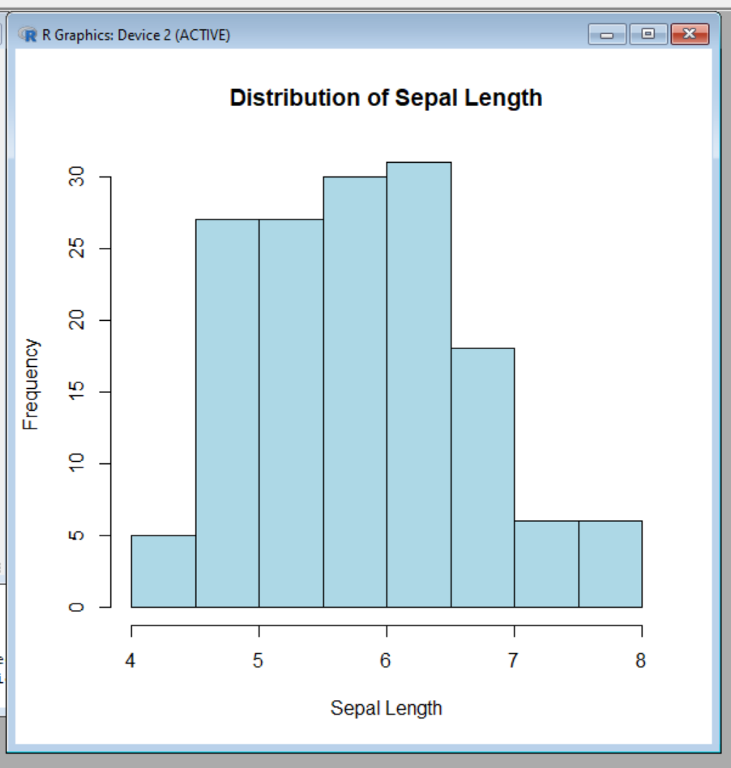
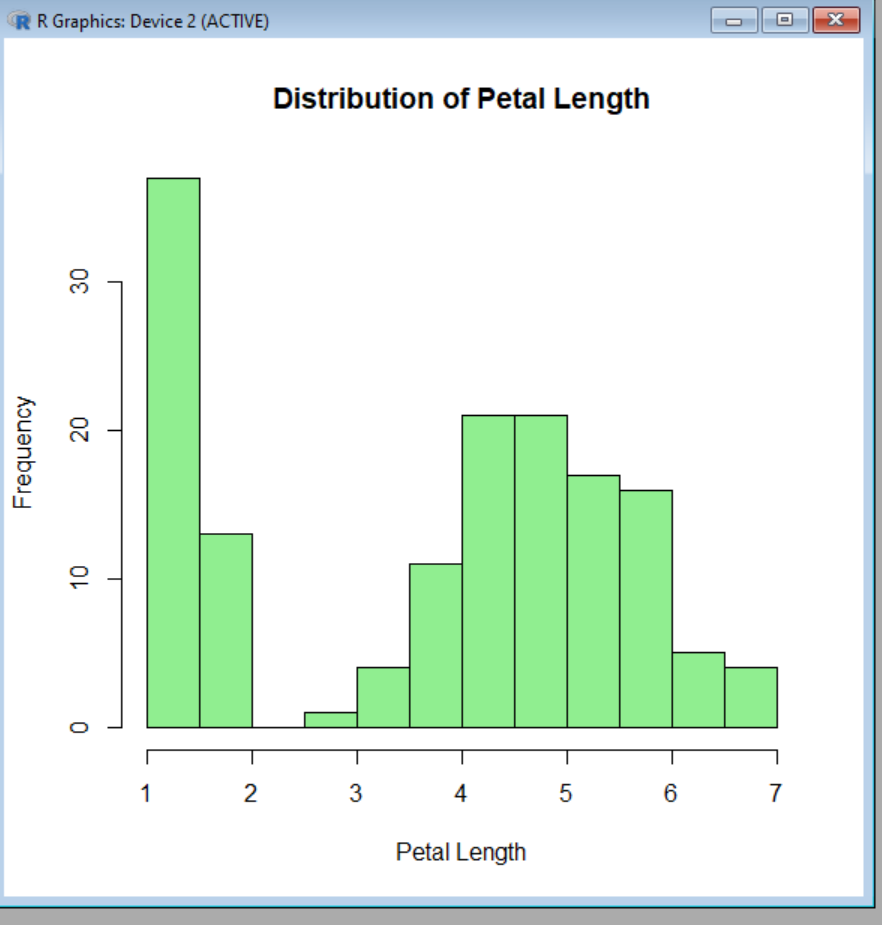
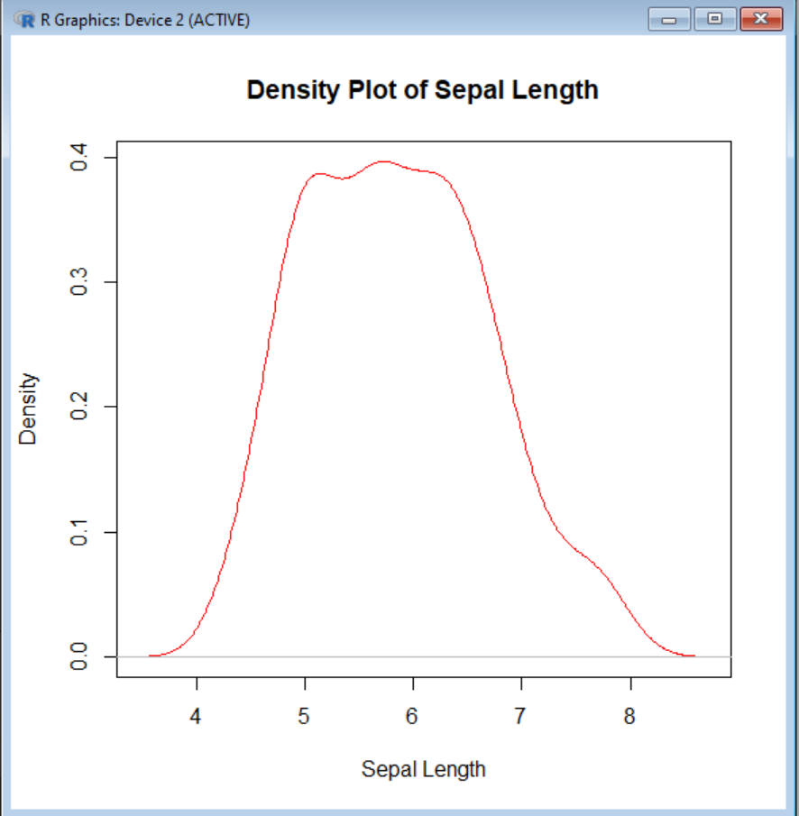
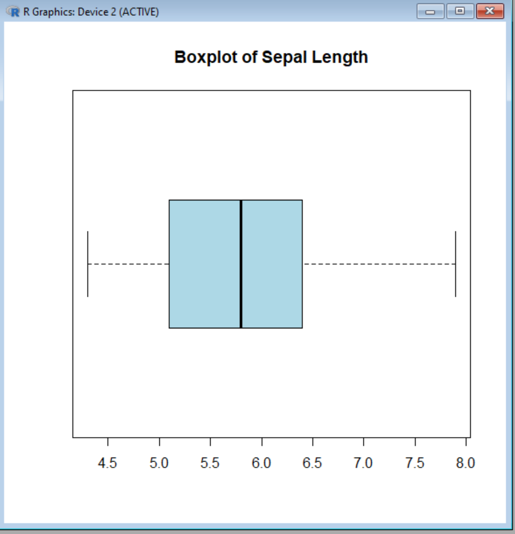
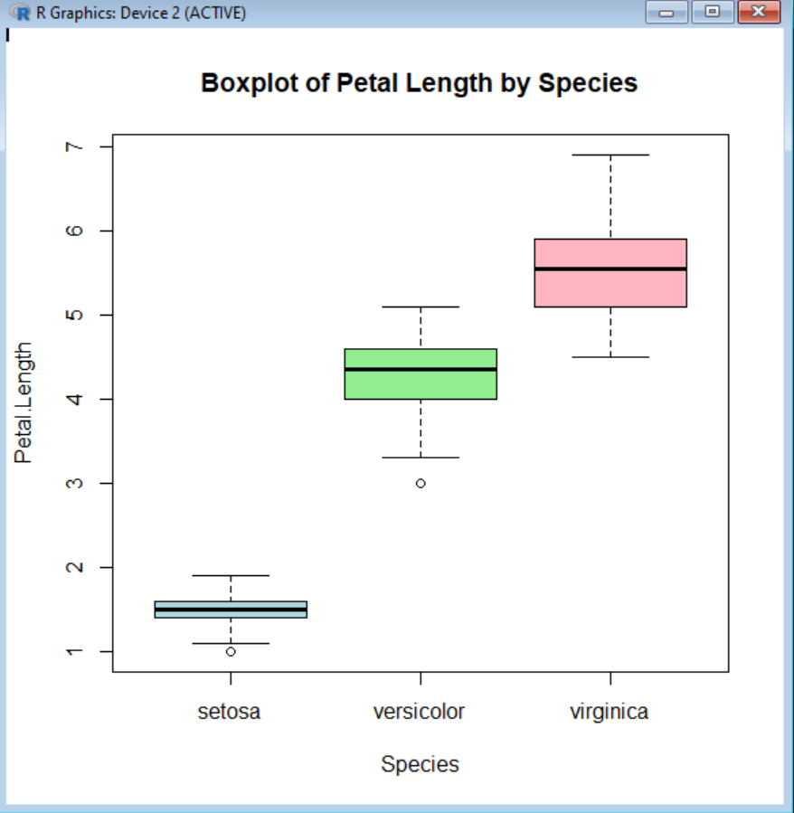
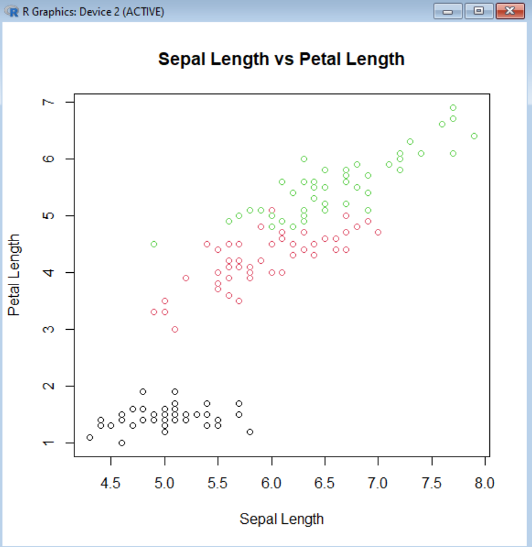

1.	Aim/Overview of the practical:
 To perform exploratory data analysis (EDA) on a chosen dataset by analyzing variable distributions, identifying outliers, and visualizing relationships between variables using plots in R.

2.	Task to be done:
  •	Select a Dataset
  •	Load the Dataset
  •	Explore the Distribution of Variables
  •	Identify Outliers
  •	Visualize Relationships Between Variables

